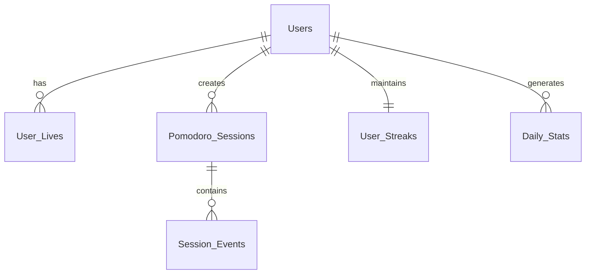

# 🗄️ Database Schema - AI Study Buddy

## 👤 Users Table
*Stores basic user account information*

| Field | Type | Description |
|-------|------|-------------|
| `user_id` | **Primary Key** | 🔑 Unique identifier for each user |
| `username` | **String** | 👤 Display name for leaderboards |
| `email` | **String** | 📧 User's email address for login |
| `password_hash` | **String** | 🔐 Encrypted password (never store plain text) |
| `created_at` | **Timestamp** | 📅 When the account was created |
| `last_login` | **Timestamp** | ⏰ Last time user logged in |
| `timezone` | **String** | 🌍 User's timezone for accurate daily resets |

---

## ❤️ User_Lives Table
*Tracks daily lives for each user*

| Field | Type | Description |
|-------|------|-------------|
| `user_id` | **Foreign Key** | 👤 Which user these lives belong to |
| `date` | **Date** | 📅 Which day (YYYY-MM-DD format) |
| `lives_remaining` | **Integer** | ❤️ Current lives left (0-5) |
| `lives_lost_today` | **Integer** | ➖ How many lives lost today |
| `blocked_at` | **Timestamp** | 🚫 When user got blocked (if lives = 0) |
| `reset_at` | **Timestamp** | 🔄 When lives were last reset to 5 |

---

## ⏰ Pomodoro_Sessions Table
*Records every study session*

| Field | Type | Description |
|-------|------|-------------|
| `session_id` | **Primary Key** | 🔑 Unique identifier for each session |
| `user_id` | **Foreign Key** | 👤 Who did this session |
| `start_time` | **Timestamp** | 🚀 When session began |
| `end_time` | **Timestamp** | 🏁 When session finished (null if still active) |
| `planned_duration` | **Integer** | ⏱️ How long session was supposed to be (25 minutes) |
| `actual_focus_time` | **Integer** | 🎯 Time actually spent focused (excluding pauses) |
| `lives_lost` | **Integer** | ➖ Lives lost during this session |
| `completed` | **Boolean** | ✅ True if session finished successfully |
| `session_date` | **Date** | 📅 Which day this session happened |

---

## 📊 User_Streaks Table
*Tracks daily and perfect focus streaks*

| Field | Type | Description |
|-------|------|-------------|
| `user_id` | **Foreign Key** | 👤 Which user these streaks belong to |
| `daily_streak` | **Integer** | 🔥 Current consecutive days of studying |
| `daily_streak_best` | **Integer** | 🏆 Longest daily streak ever achieved |
| `perfect_focus_streak` | **Integer** | ⭐ Current consecutive sessions without losing lives |
| `perfect_focus_best` | **Integer** | 🥇 Longest perfect focus streak ever |
| `last_study_date` | **Date** | 📅 Last date user completed a session |
| `last_perfect_date` | **Date** | ⭐ Last date user had a perfect session |

---

## 🏆 Daily_Stats Table
*Aggregated daily statistics for quick leaderboard access*

| Field | Type | Description |
|-------|------|-------------|
| `user_id` | **Foreign Key** | 👤 Which user |
| `date` | **Date** | 📅 Which day |
| `sessions_completed` | **Integer** | ✅ Number of successful Pomodoros |
| `total_focus_time` | **Integer** | 🎯 Minutes of actual focused study |
| `total_session_time` | **Integer** | ⏱️ Minutes of total session time (including pauses) |
| `lives_lost` | **Integer** | ➖ Total lives lost this day |
| `focus_quality` | **Decimal** | 📊 Percentage (focus_time / session_time * 100) |

---

## 🎯 Session_Events Table
*Detailed log of what happened during sessions*

| Field | Type | Description |
|-------|------|-------------|
| `event_id` | **Primary Key** | 🔑 Unique identifier for each event |
| `session_id` | **Foreign Key** | ⏰ Which session this event belongs to |
| `event_type` | **Enum** | 📝 What happened: 'tab_switch', 'pause', 'resume', 'complete' |
| `timestamp` | **Timestamp** | ⏰ Exact time the event occurred |
| `duration_away` | **Integer** | ⏱️ If tab switch, how long user was away (seconds) |

---

## 🔗 Table Relationships



### Relationship Details
- **Users → User_Lives:** One user has many daily life records
- **Users → Pomodoro_Sessions:** One user has many sessions
- **Users → User_Streaks:** One user has one current streak record
- **Users → Daily_Stats:** One user has many daily stat records
- **Pomodoro_Sessions → Session_Events:** One session has many events

---

## 🎯 Key Design Principles

### 💡 Why These Fields?
- **`user_id`** appears in most tables to link everything to a user
- **Separate `actual_focus_time` vs `total_session_time`** to track real productivity
- **`date` fields** allow daily resets and historical tracking
- **`completed` flag** distinguishes successful vs abandoned sessions
- **`focus_quality` pre-calculated** for fast leaderboard queries

### 🟢 For Beginners
1. **Start with just `Users` and `Pomodoro_Sessions` tables**
2. **Add other tables** as you build more features
3. **Use simple integer IDs** and timestamps
4. **Keep it simple** - you can always add fields later

---

## 📈 Implementation Phases

### Phase 1: MVP Database
```sql
-- Essential tables only
Users
Pomodoro_Sessions
```

### Phase 2: Gamification
```sql
-- Add engagement features
User_Lives
User_Streaks
```

### Phase 3: Analytics
```sql
-- Add performance tracking
Daily_Stats
Session_Events
```

> **Design Philosophy:** This schema captures all the data you need while keeping it simple enough for a beginner to understand and implement!